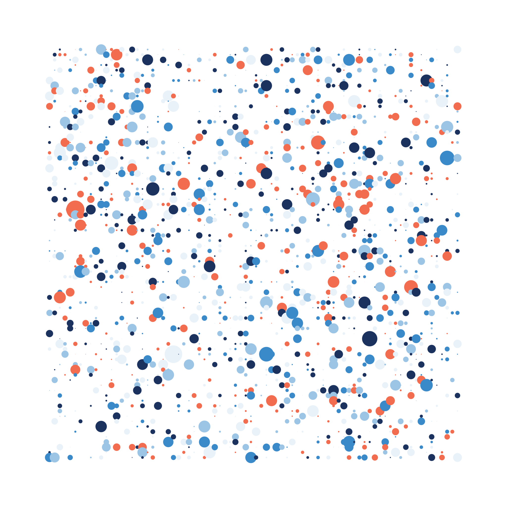
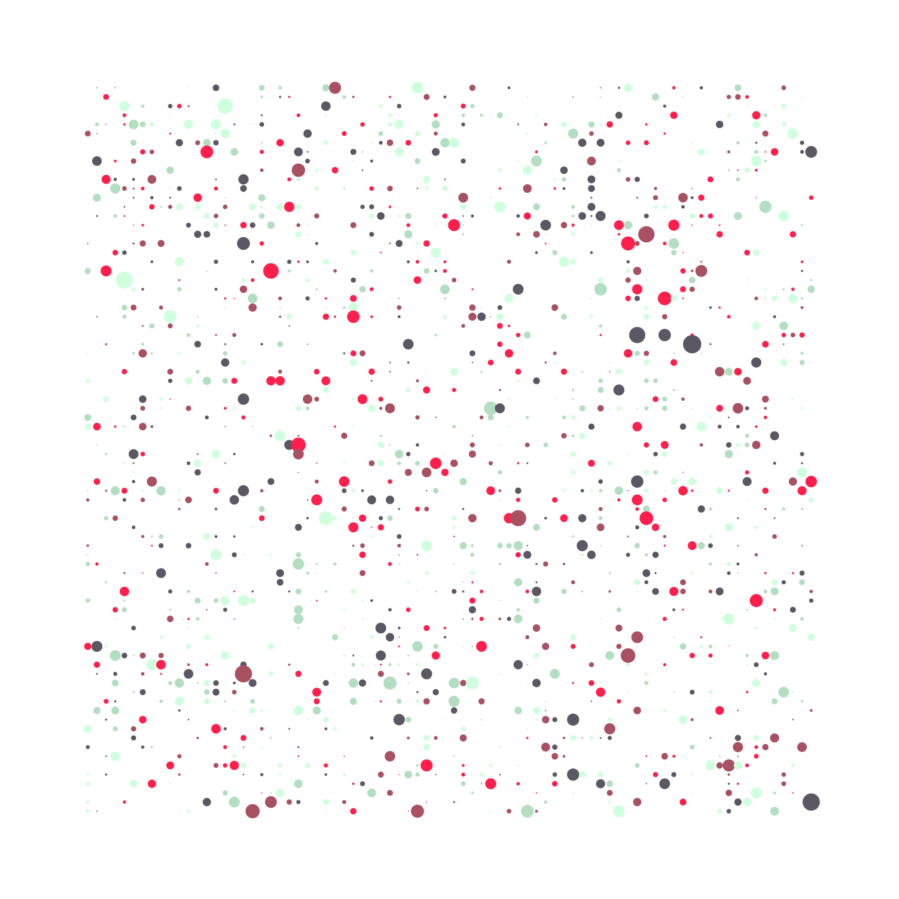
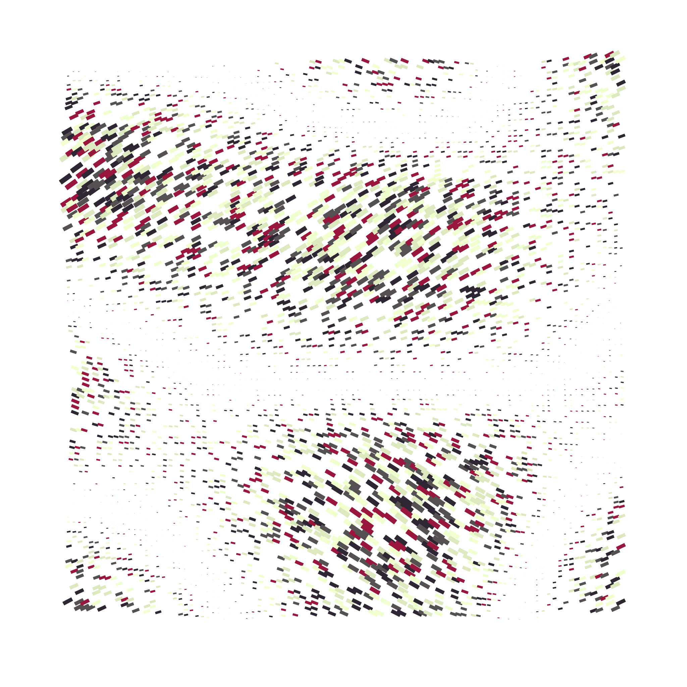
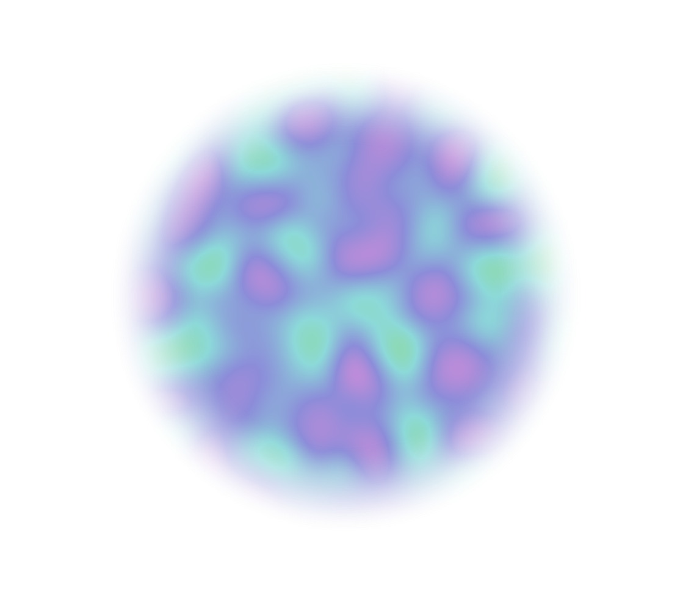
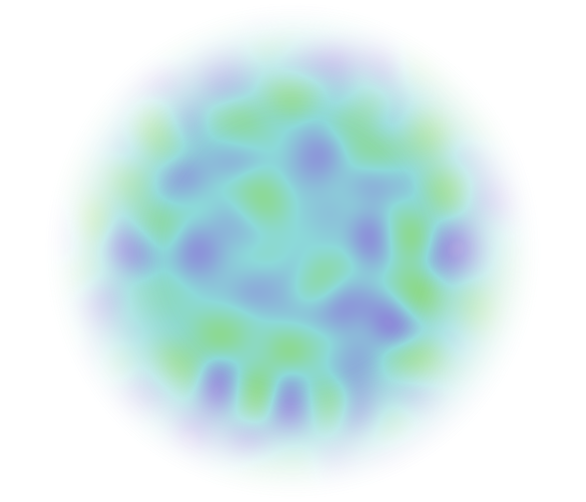

# Creative Coding Course on Frontend Masters

Work inspiration from the Creative Coding Course - Frontend Masters - by Matt DesLauriers. [This link](https://github.com/mattdesl/workshop-generative-art.git) directs to the GitHub repository shared in the cousrse.

## Grid-like art
<!-- 

 -->

## Generative wall

## 3D gif animation

## Shaders

